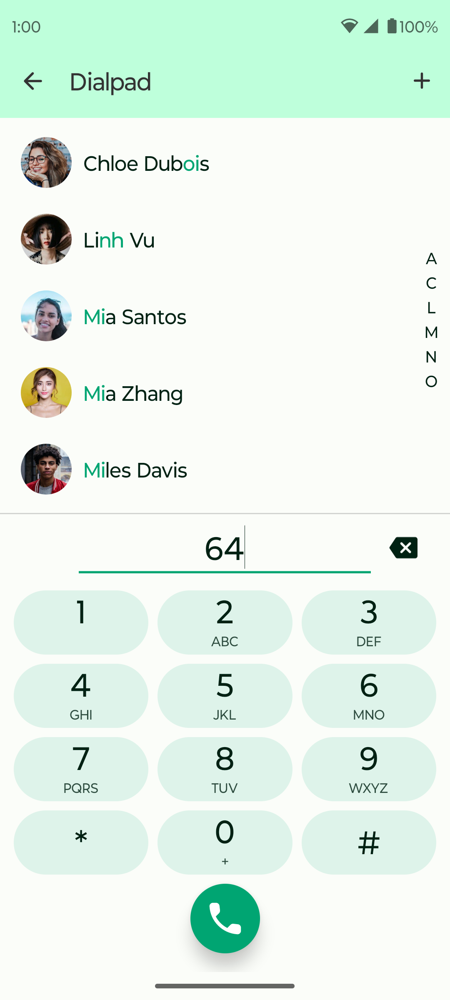
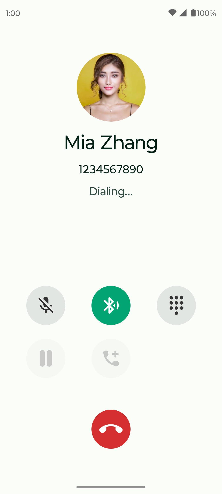
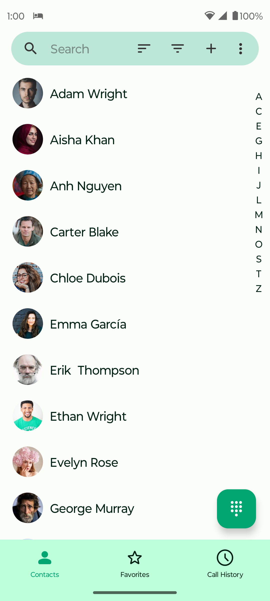

# Fossify Phone

  

Empower your calls, and safeguard your data. Fossify Phone redefines the mobile app experience with unmatched privacy and efficiency. Free from ads and intrusive permissions, it's designed for seamless and secure everyday communication.

📱 **YOUR PRIVACY, OUR PRIORITY:**  
Welcome to the Fossify Phone App, where your digital privacy is paramount. Switch to a mobile experience that respects your data, ensuring your personal information remains secure and private.

🚀 **SEAMLESS PERFORMANCE:**  
The Fossify Phone App offers a fluid and responsive mobile interface, enhancing your phone's performance while safeguarding your privacy. Experience a lag-free, smooth user experience, optimized for efficiency and speed.

🌐 **OPEN-SOURCE ASSURANCE:**  
With the Fossify Phone App, transparency is at your fingertips. Built on an open-source foundation, our app allows you to review our code on GitHub, fostering trust and a community committed to privacy.

🖼️ **TAILOR-MADE CUSTOMIZATION:**  
Customize your mobile experience with the Fossify Phone App. Adjust your app settings for a personalized interface, from thematic designs to functional preferences. Enjoy a user interface that's intuitive and uniquely yours.

🔋 **EFFICIENT RESOURCE MANAGEMENT:**  
The Fossify Phone App is designed for optimal resource usage, contributing to extended battery life. It's light on your phone's resources, ensuring your device runs efficiently with minimized battery drain.

Download the Fossify Phone App now and step into a mobile world where privacy seamlessly blends with functionality. Your journey towards a safer, personalized mobile experience starts here.

➡️ Explore more Fossify apps: https://www.fossify.org 
➡️ Open-Source Code: https://www.github.com/FossifyOrg 
➡️ Join the community on Reddit: https://www.reddit.com/r/Fossify 
➡️ Connect on Telegram: https://t.me/Fossify

